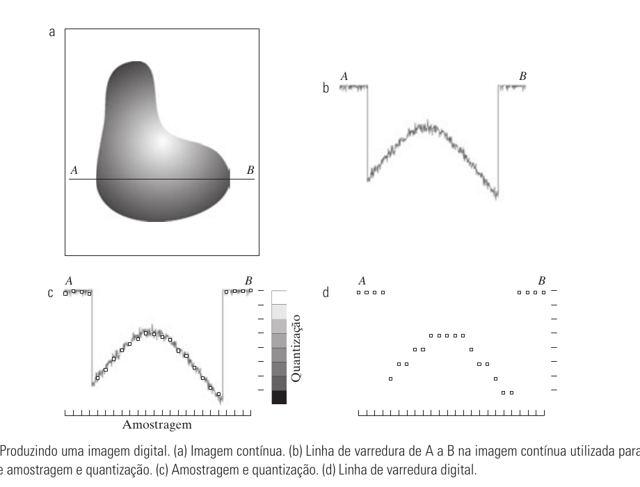
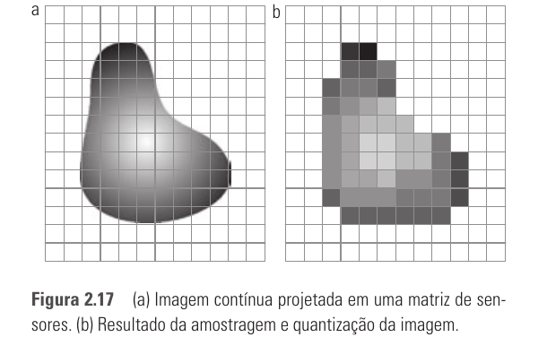
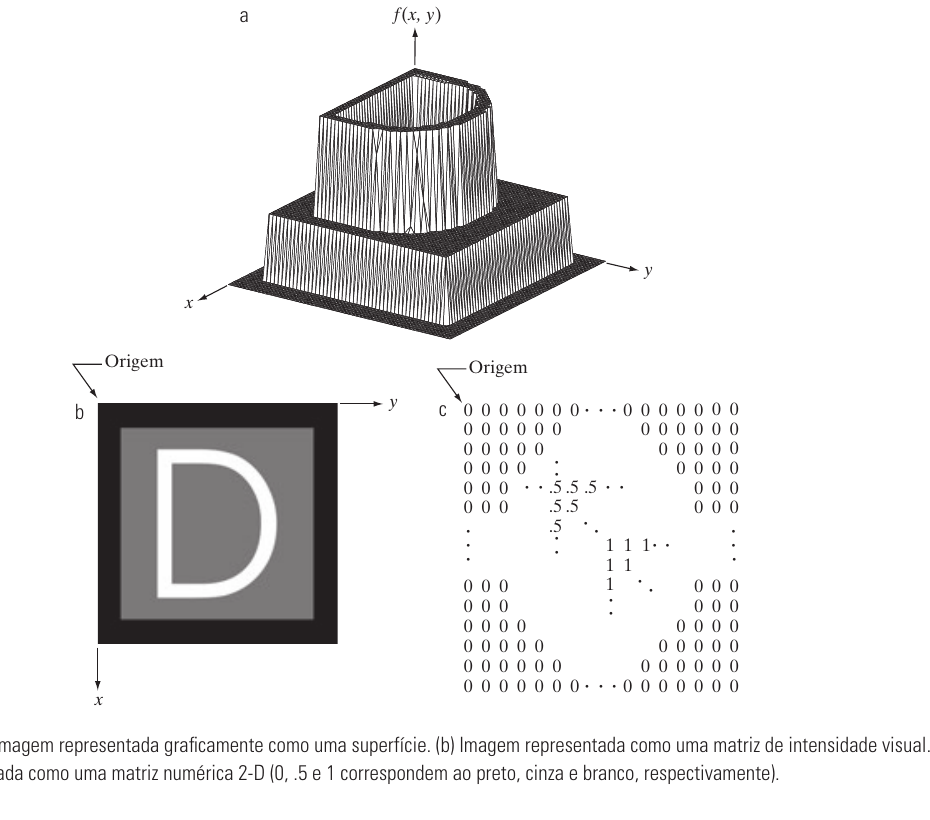
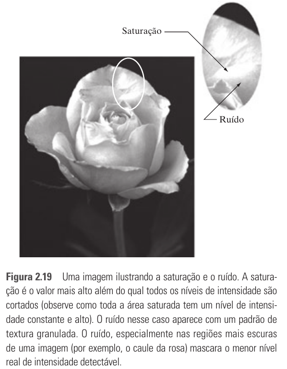
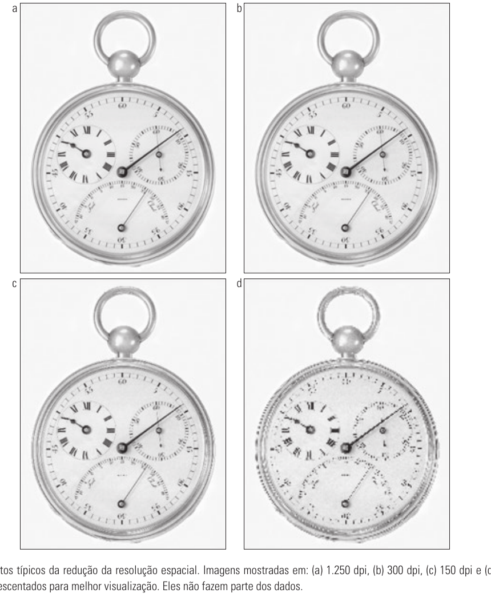
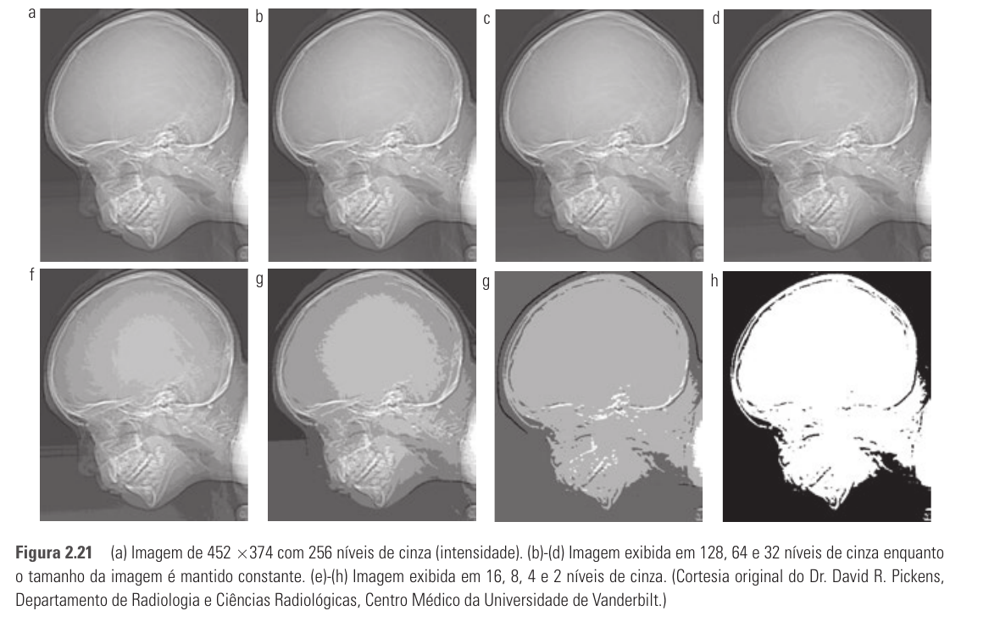
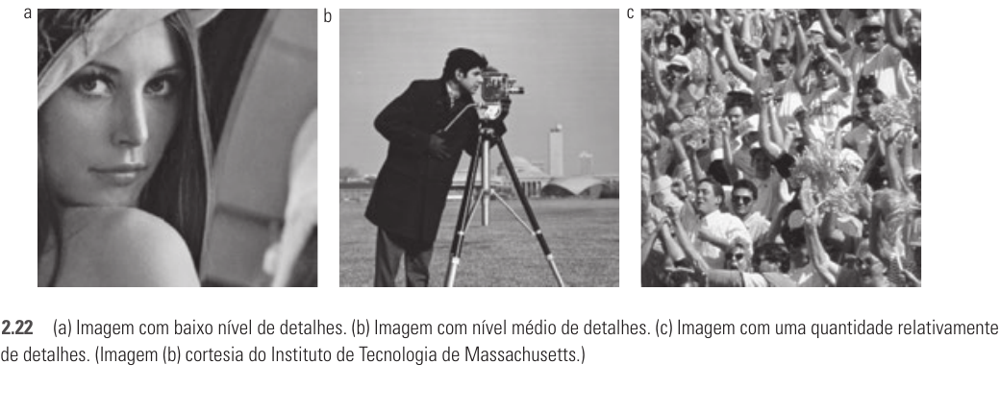
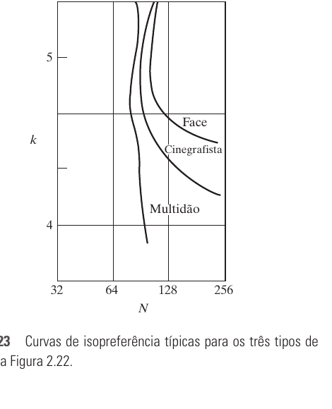
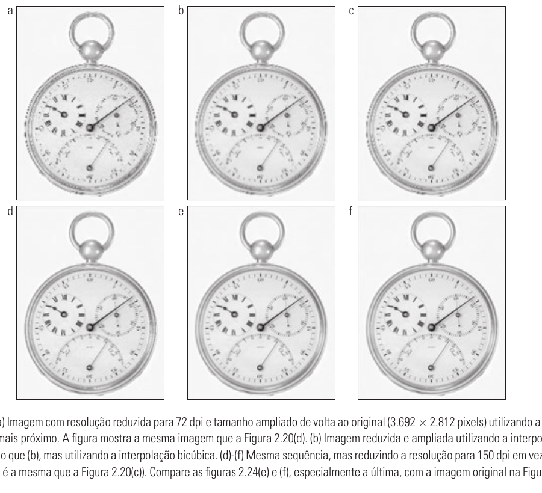

# Seção 2.4 - Amostragem E Quantização De Imagens

Páginas usadas: PDF 52-61.

## Ideia Central

- Imagens captadas por sensores geralmente começam como sinais contínuos.
- Para virar imagem digital, o sinal precisa passar por:
  - amostragem: discretiza as coordenadas espaciais;
  - quantização: discretiza os níveis de intensidade.
- A qualidade final depende do número de amostras, do número de níveis de intensidade, do ruído e do conteúdo da imagem.



## Conceitos Principais

- Uma imagem contínua pode variar em `x`, `y` e intensidade.
- Amostragem escolhe pontos discretos no espaço.
- Quantização atribui a cada ponto um valor discreto de intensidade.
- Com matriz de sensores, o número de sensores limita diretamente a amostragem nas duas direções.
- Com sensor único ou sensor de linha, o movimento mecânico também influencia a amostragem.



## Representação Digital

- Uma imagem contínua é representada por `f(s, t)`.
- Após digitalização, passa a ser `f(x, y)`, com coordenadas discretas.
- Para uma imagem com `M` linhas e `N` colunas:

```text
x = 0, 1, ..., M - 1
y = 0, 1, ..., N - 1
```

- A origem usual fica no canto superior esquerdo.
- Cada elemento da matriz é um pixel.



## Fórmulas Importantes

```text
L = 2^k
```

- `L`: número de níveis de intensidade.
- `k`: número de bits por pixel.
- Exemplo: `k = 8` gera `L = 256` níveis.

```text
b = M x N x k
```

- `b`: bits necessários para armazenar uma imagem `M x N`.

```text
b = N^2 x k
```

- Caso especial para imagem quadrada `N x N`.

## Faixa Dinâmica, Ruído E Contraste

- Faixa dinâmica: razão entre maior intensidade mensurável e menor intensidade detectável.
- Saturação: valores acima do limite máximo são cortados.
- Ruído: pode esconder detalhes, principalmente em regiões escuras.
- Contraste: diferença entre níveis altos e baixos de intensidade.



## Resolução

### Resolução Espacial

- Mede o menor detalhe espacial discernível.
- Pode ser expressa em pares de linha por unidade de distância ou em `dpi`.
- Tamanho em pixels sozinho não basta: `1024 x 1024` só faz sentido junto da escala física.



### Resolução De Intensidade

- Mede a menor diferença discernível de intensidade.
- Na prática, é indicada pelo número de bits.
- `8 bits` significa `256` níveis de intensidade.
- Menos níveis podem gerar falso contorno.



## Falso Contorno

- Ocorre quando há poucos níveis de intensidade para representar regiões suaves.
- A imagem passa a mostrar faixas artificiais, parecidas com curvas de nível.
- Fica comum com `16` níveis de cinza ou menos.

## Relação Entre N, k E Conteúdo

- `N`: número de amostras espaciais.
- `k`: bits por pixel.
- Imagens com muitos detalhes podem tolerar menos níveis de intensidade.
- Imagens suaves tendem a exigir mais níveis para evitar falso contorno.
- Curvas de isopreferência mostram combinações de `N` e `k` percebidas com qualidade semelhante.





## Interpolação

- Interpolação estima valores desconhecidos a partir de valores conhecidos.
- É usada em ampliação, redução, rotação, correções geométricas e reamostragem.

### Tipos

- Vizinho mais próximo: simples, mas pode gerar blocos e distorções em bordas.
- Bilinear: usa 4 vizinhos e melhora bastante o resultado.
- Bicúbica: usa 16 vizinhos e preserva melhor detalhes finos.

```text
v(x, y) = ax + by + cxy + d
```

- Fórmula da interpolação bilinear.

```text
v(x, y) = sum_{i=0}^{3} sum_{j=0}^{3} a_ij x^i y^j
```

- Fórmula da interpolação bicúbica.



## Imagens Da Seção

- `fig-2-16-amostragem-quantizacao.png`
- `fig-2-17-matriz-sensores.png`
- `fig-2-18-representacoes-imagem-digital.png`
- `fig-2-19-saturacao-ruido.png`
- `fig-2-20-reducao-resolucao-espacial.png`
- `fig-2-21-reducao-niveis-cinza.png`
- `fig-2-22-niveis-detalhe.png`
- `fig-2-23-curvas-isopreferencia.png`
- `fig-2-24-comparacao-interpolacao.png`

## Pontos De Prova

- O que é amostragem?
- O que é quantização?
- Qual a diferença entre resolução espacial e resolução de intensidade?
- Como calcular `L` a partir de `k`?
- Como calcular o armazenamento necessário para uma imagem?
- O que é faixa dinâmica?
- O que são saturação e ruído?
- O que é falso contorno?
- Por que o conteúdo da imagem influencia a escolha de `N` e `k`?
- O que são curvas de isopreferência?
- Para que serve interpolação?
- Compare vizinho mais próximo, bilinear e bicúbica.
