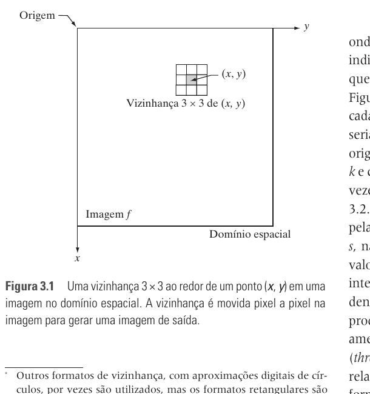
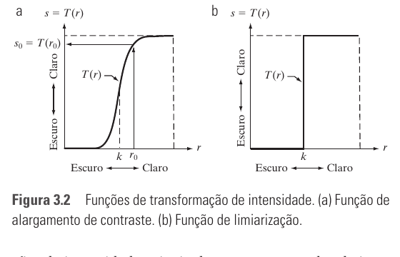

# Seção 3.1 - Fundamentos

Páginas usadas: PDF 86-88.

## Ideia Central

- Processos no domínio espacial podem ser descritos como uma operação aplicada à imagem de entrada para gerar uma imagem de saída.
- A operação pode depender de um único pixel ou de uma vizinhança ao redor dele.

## Fórmulas / Relações Importantes

```text
g(x, y) = T[f(x, y)]
```

- `f(x, y)`: imagem de entrada.
- `g(x, y)`: imagem de saída.
- `T`: operador aplicado sobre `f` em torno do ponto `(x, y)`.

```text
s = T(r)
```

- Caso especial em que a vizinhança é `1 x 1`.
- `r`: intensidade de entrada.
- `s`: intensidade de saída.
- Nesse caso, a operação é uma transformação de intensidade.

## Conceitos Principais

- Vizinhança: pequena região ao redor de um pixel.
- Filtro espacial: vizinhança mais uma operação definida.
- Também pode ser chamado de máscara espacial, kernel, template ou janela.
- O filtro percorre a imagem pixel por pixel.
- Em bordas, pode-se ignorar vizinhos externos ou preencher a imagem com uma borda artificial.



## Transformações De Intensidade

- Quando a vizinhança é `1 x 1`, cada pixel de saída depende apenas do pixel correspondente de entrada.
- Exemplos:
  - alargamento de contraste;
  - limiarização.
- Alargamento de contraste aumenta diferenças entre intensidades claras e escuras.
- Limiarização transforma a imagem em dois níveis, normalmente claro e escuro.



## Pontos De Prova

- O que representa `g(x, y) = T[f(x, y)]`?
- O que é uma vizinhança em processamento espacial?
- O que é um filtro espacial?
- O que acontece quando a vizinhança tem tamanho `1 x 1`?
- Qual a diferença entre processamento ponto a ponto e por vizinhança?
- O que é alargamento de contraste?
- O que é limiarização?
- Como tratar pixels na borda da imagem durante filtragem espacial?
