# Seção 3.2 - Funções Básicas De Transformação De Intensidade

Páginas usadas: PDF 88-96.

## Ideia Central

- Transformações de intensidade mapeiam cada valor de entrada `r` para um valor de saída `s`.
- São operações ponto a ponto: cada pixel é processado independentemente.
- Em imagens digitais, o mapeamento pode ser implementado por tabela indexada.

## Fórmulas / Relações Importantes

```text
s = T(r)
```

```text
s = L - 1 - r
```

- Negativo de imagem.

```text
s = c log(1 + r)
```

- Transformação logarítmica.

```text
s = c r^gamma
```

- Transformação de potência, também chamada de transformação gama.

## Conceitos Principais

- Função identidade: não altera a imagem.
- Negativo: inverte os níveis de intensidade; útil para realçar detalhes claros em regiões escuras.
- Log: expande níveis escuros e comprime níveis claros; útil para comprimir faixa dinâmica.
- Potência/gama:
  - `gamma < 1`: clareia regiões escuras;
  - `gamma > 1`: escurece/comprime regiões claras;
  - usada em correção gama de dispositivos.
- Funções lineares por partes permitem controlar faixas específicas de intensidade.

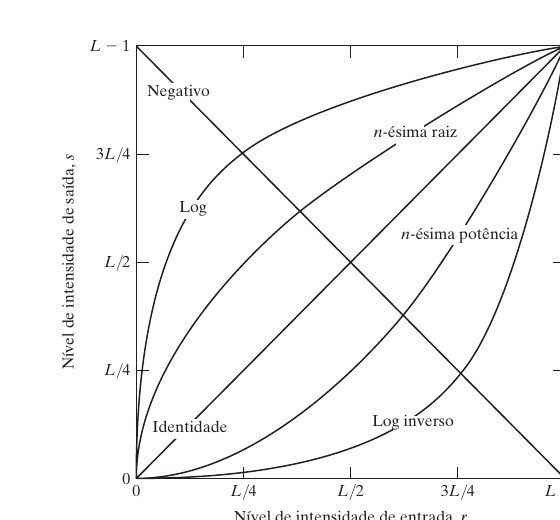

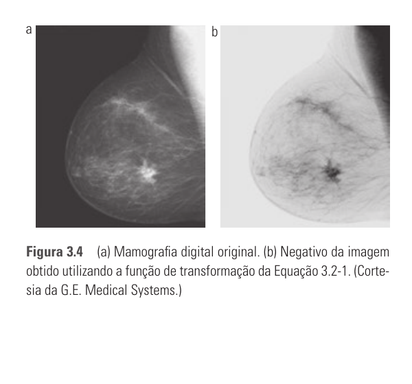

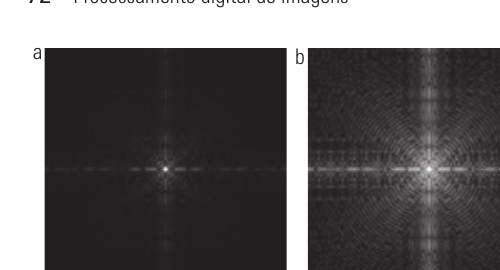

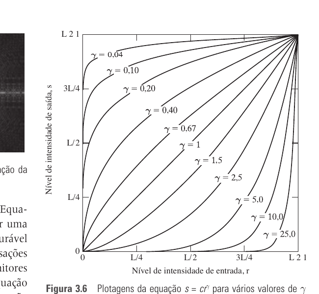

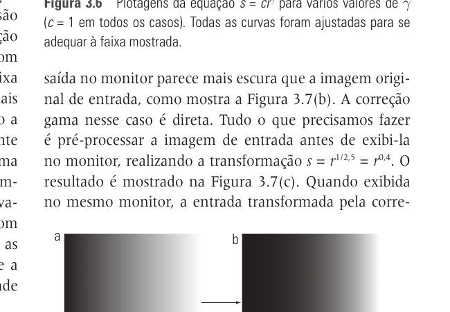

## Alargamento, Fatiamento E Planos De Bits

- Alargamento de contraste aumenta a faixa ocupada pelos níveis de intensidade.
- Limiarização é o caso extremo que transforma a imagem em binária.
- Fatiamento de níveis realça uma faixa `[A, B]` de intensidades.
- Fatiamento por planos de bits separa uma imagem de 8 bits em 8 imagens binárias.
- Planos de bits mais significativos concentram mais informação visual.
- Planos menos significativos carregam detalhes sutis e ruído.

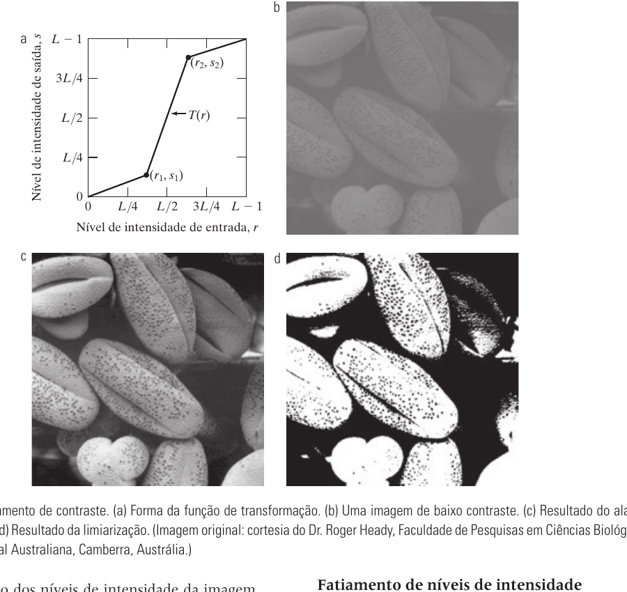

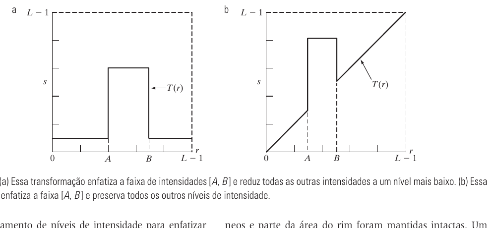

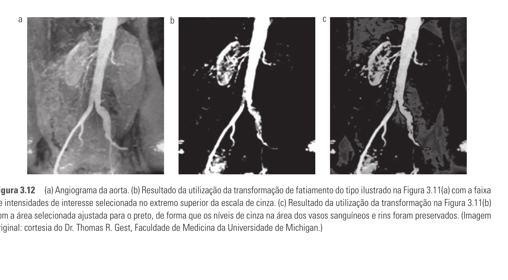

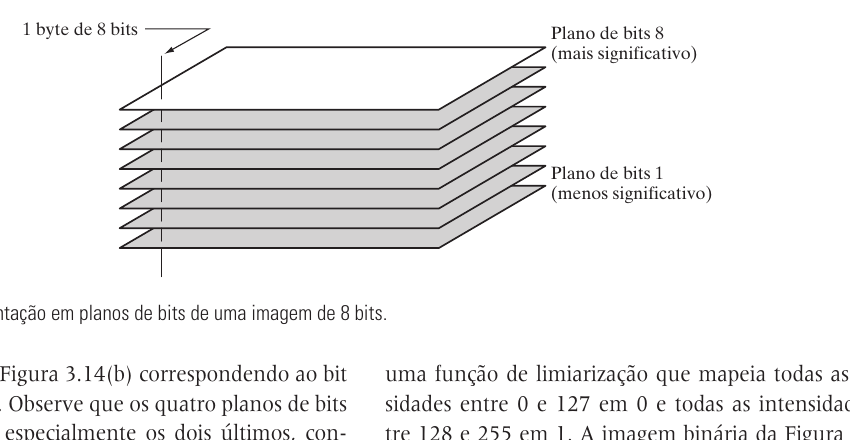

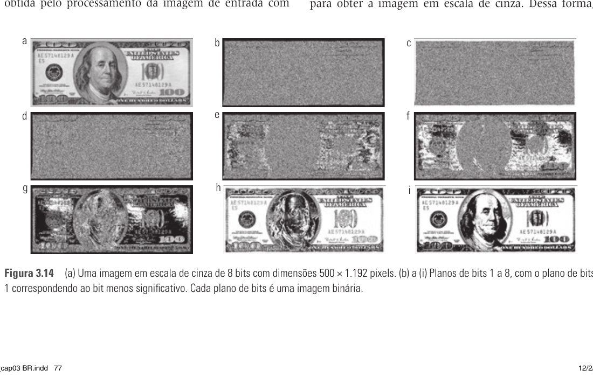

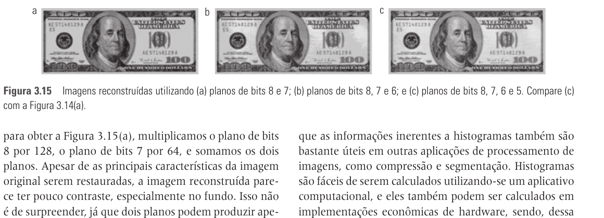

## Pontos De Prova

- O que significa mapear `r` em `s`?
- Qual é a fórmula do negativo de imagem?
- Para que serve uma transformação logarítmica?
- O que acontece quando `gamma < 1`?
- O que acontece quando `gamma > 1`?
- O que é correção gama?
- O que é alargamento de contraste?
- O que é limiarização?
- O que é fatiamento de níveis de intensidade?
- O que é fatiamento por planos de bits?
- Por que os planos de bits mais significativos são mais importantes visualmente?
