# Seção 3.3 - Processamento De Histograma

Páginas usadas: PDF 96-111.

## Ideia Central

- O histograma descreve quantos pixels existem em cada nível de intensidade.
- Ele é uma ferramenta central para analisar brilho, contraste e distribuição tonal.
- A manipulação de histogramas permite realçar imagens automaticamente ou com um histograma desejado.

## Fórmulas / Relações Importantes

```text
h(r_k) = n_k
```

- `r_k`: k-ésimo nível de intensidade.
- `n_k`: número de pixels com intensidade `r_k`.

```text
p(r_k) = n_k / MN
```

- Histograma normalizado.
- `MN`: número total de pixels.

```text
s_k = (L - 1) sum_{j=0}^{k} p(r_j)
```

- Transformação discreta de equalização de histograma.

## Conceitos Principais

- Imagem escura: histograma concentrado em níveis baixos.
- Imagem clara: histograma concentrado em níveis altos.
- Baixo contraste: histograma estreito.
- Alto contraste: histograma espalhado por uma faixa ampla.
- Equalização de histograma tenta espalhar melhor os níveis de intensidade.
- Especificação de histograma tenta produzir uma imagem com histograma parecido com um histograma desejado.
- Processamento local usa histogramas em vizinhanças, não na imagem inteira.

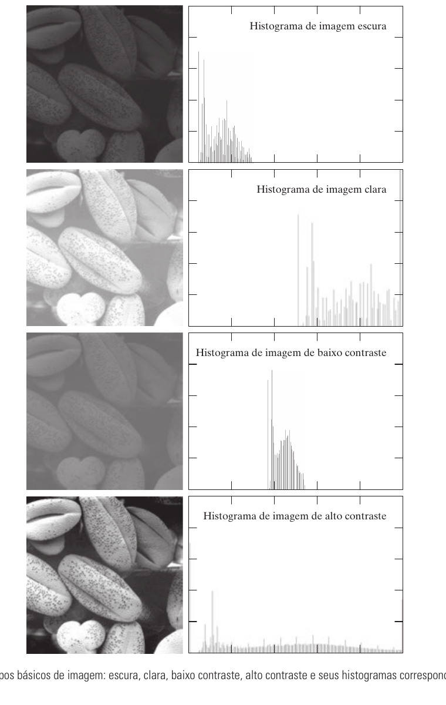

## Equalização De Histograma

- Busca gerar uma imagem com distribuição de intensidades mais espalhada.
- Costuma melhorar contraste quando o histograma original ocupa uma faixa estreita.
- Nem sempre produz o melhor resultado visual.
- Pode deixar a imagem clara demais ou com aparência desbotada quando há grande concentração de pixels em certos níveis.

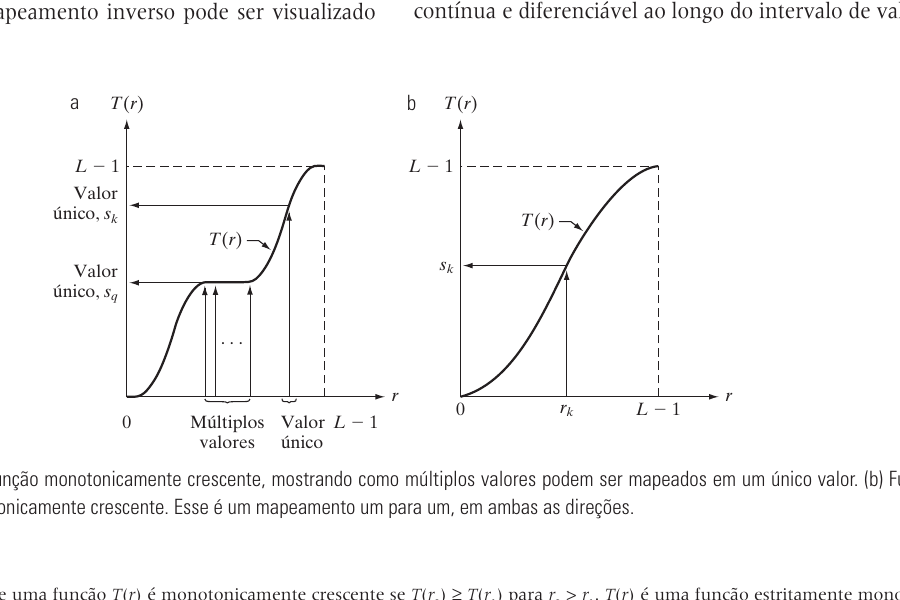

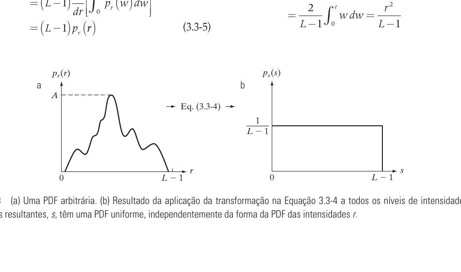

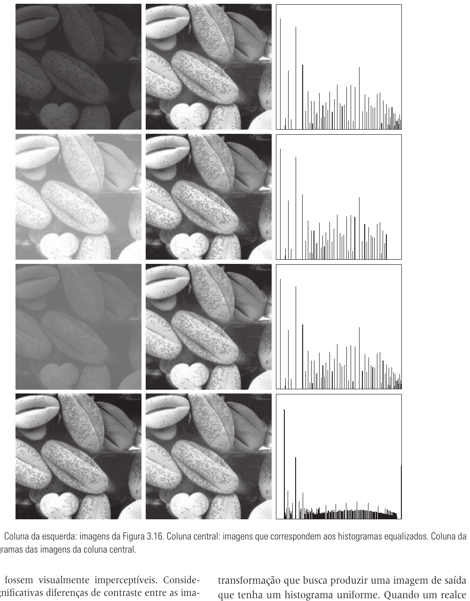

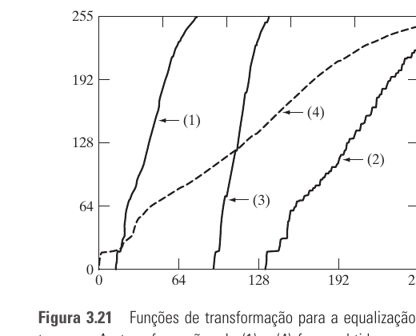

## Especificação De Histograma

- Também chamada de correspondência de histograma.
- Em vez de buscar uma distribuição uniforme, define-se uma distribuição desejada.
- É útil quando a equalização global piora a aparência da imagem.
- O processo envolve calcular a equalização da imagem de entrada e mapear os valores para o histograma especificado.

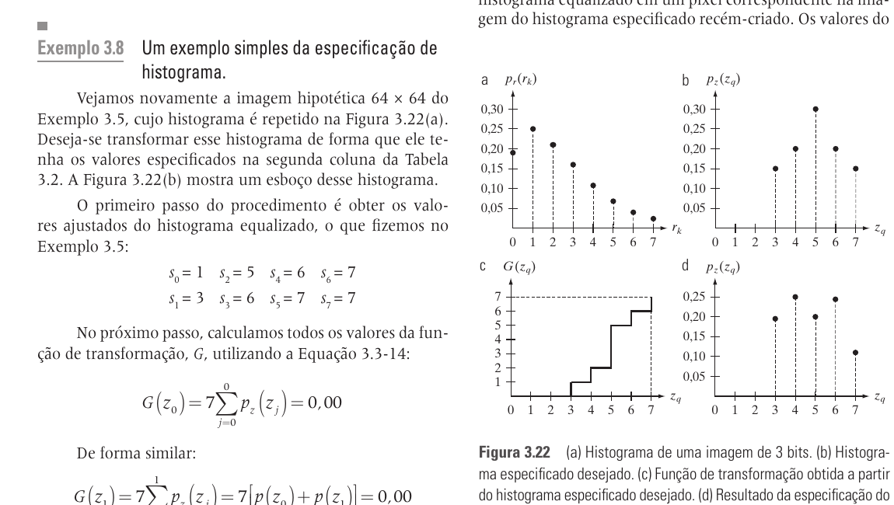

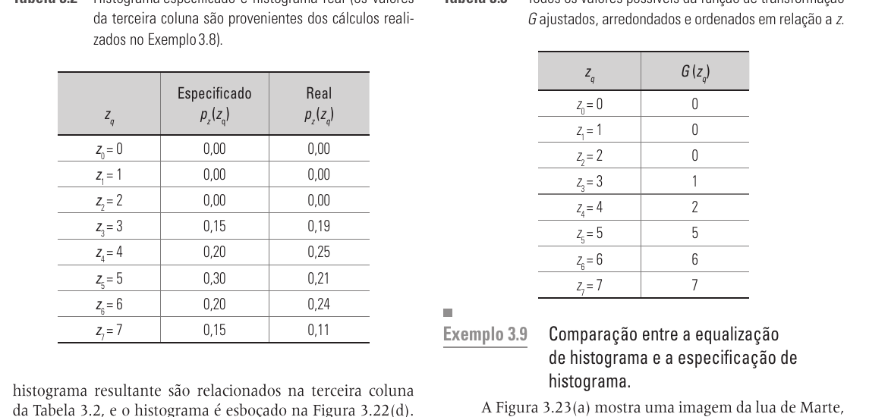

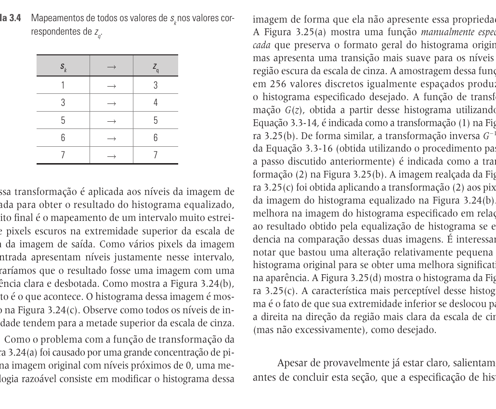

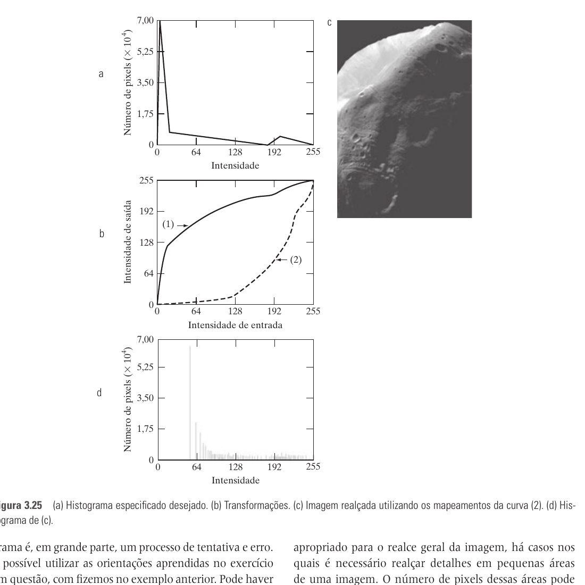

## Processamento Local E Estatísticas

- Processamento global usa a imagem inteira.
- Processamento local usa uma vizinhança ao redor de cada pixel.
- Equalização local pode revelar detalhes pequenos que não aparecem na equalização global.
- Média global/local mede intensidade média.
- Variância ou desvio padrão mede contraste.
- Estatísticas locais permitem realçar apenas regiões que satisfazem condições de brilho e contraste.

```text
media = sum r_i p(r_i)
```

```text
variancia = sum (r_i - media)^2 p(r_i)
```

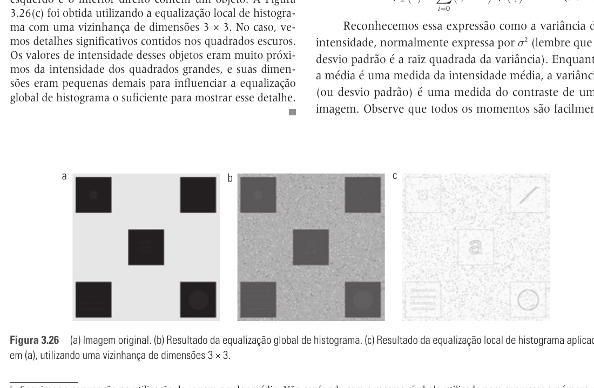

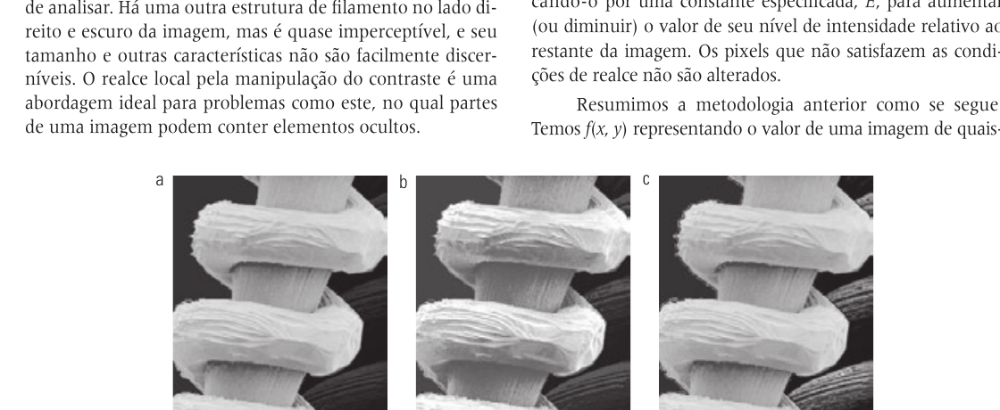

## Pontos De Prova

- O que é um histograma de imagem?
- O que representa um histograma normalizado?
- Como o histograma indica imagem escura, clara, de baixo contraste e de alto contraste?
- Qual é a ideia da equalização de histograma?
- Por que equalização global nem sempre melhora a imagem?
- O que é especificação de histograma?
- Qual a diferença entre equalização e especificação de histograma?
- Qual a diferença entre processamento global e local de histograma?
- Como média e variância ajudam no realce local?
- Por que estatísticas locais podem revelar detalhes ocultos?
