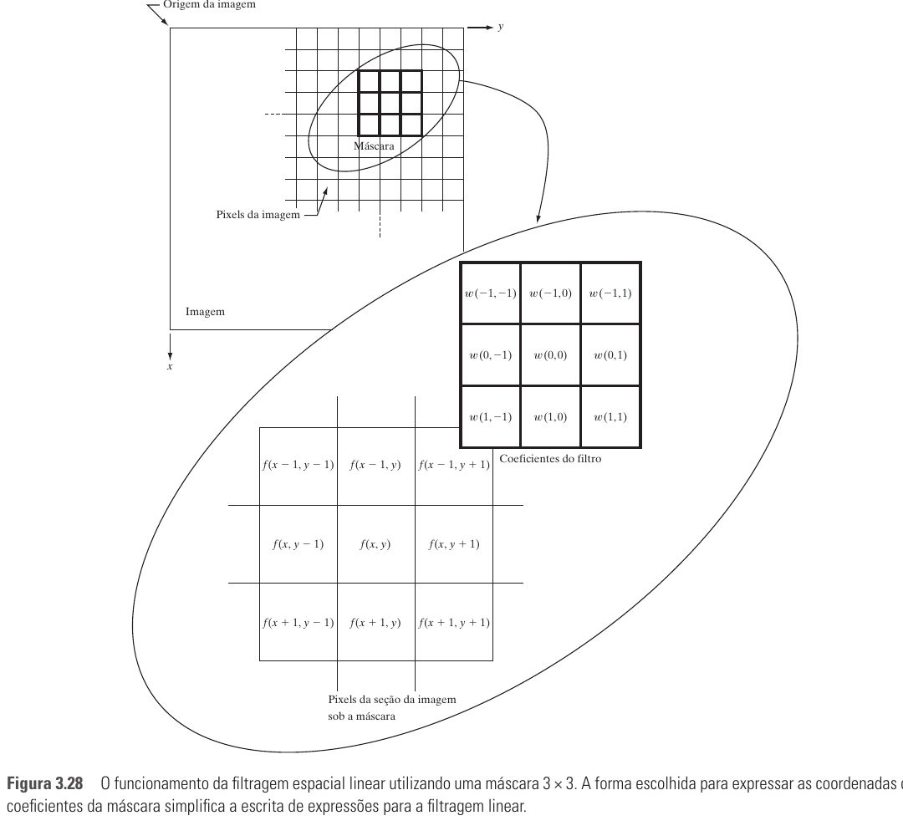
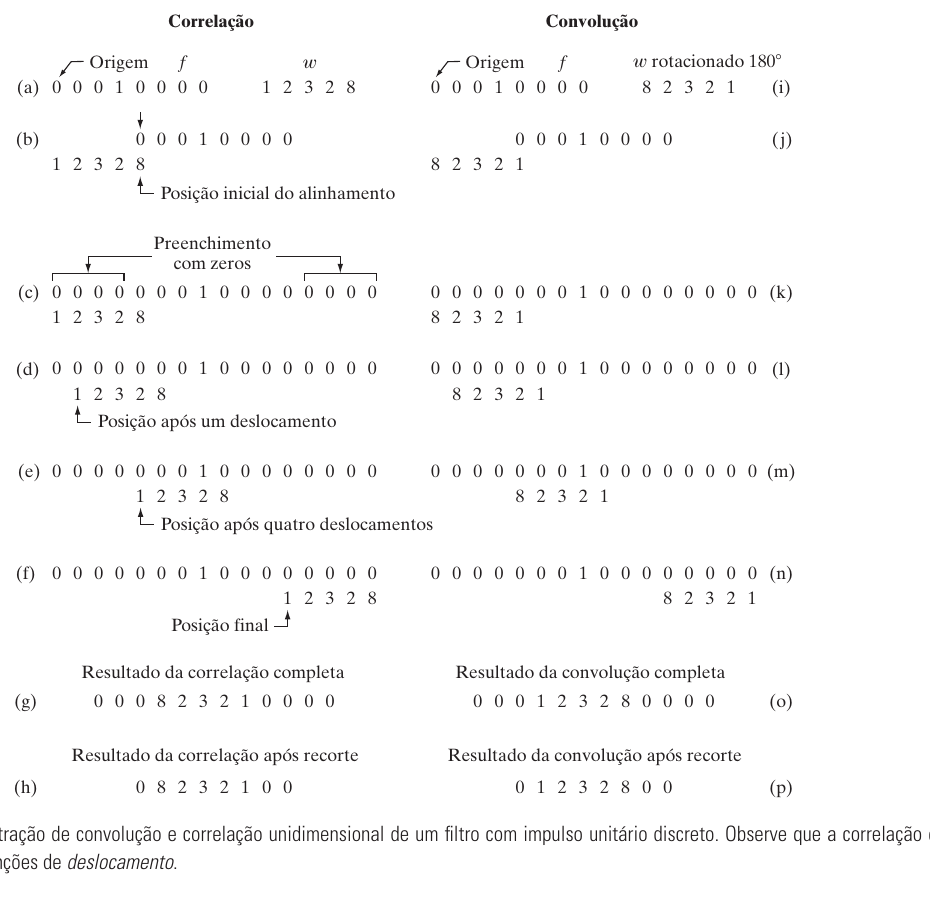
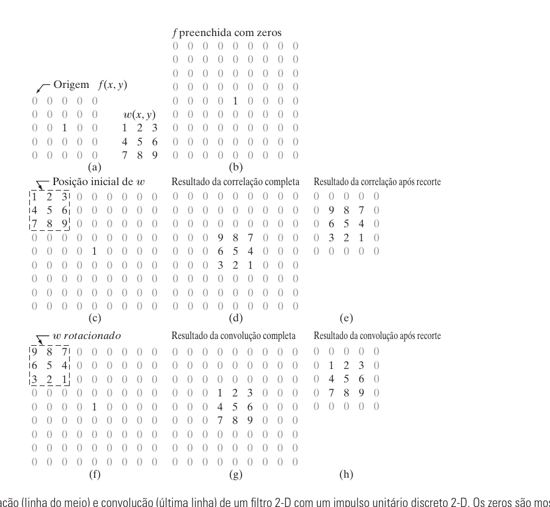
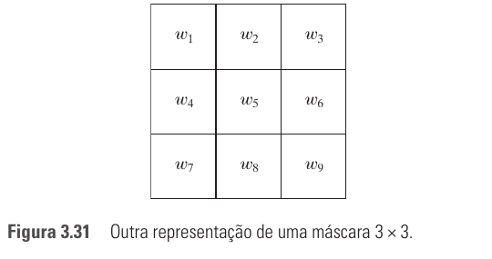

# Seção 3.4 - Fundamentos Da Filtragem Espacial

Páginas usadas: PDF 112-118.

## Ideia Central

- Filtragem espacial processa uma imagem usando uma vizinhança ao redor de cada pixel.
- A máscara percorre a imagem; em cada posição, a resposta calculada vira o pixel correspondente da imagem filtrada.
- Filtros espaciais podem ser lineares, quando usam soma de produtos, ou não lineares, quando usam outra operação sobre a vizinhança.

## Fórmulas / Relações Importantes

```text
g(x,y) = soma dos produtos entre coeficientes da máscara e pixels cobertos
```

```text
g(x,y) = sum_{s=-a}^{a} sum_{t=-b}^{b} w(s,t) f(x+s,y+t)

m = 2a + 1
n = 2b + 1
```

```text
Correlação:
corr[w,f](x,y) = sum_{s=-a}^{a} sum_{t=-b}^{b} w(s,t) f(x+s,y+t)

Convolução:
conv[w,f](x,y) = sum_{s=-a}^{a} sum_{t=-b}^{b} w(s,t) f(x-s,y-t)
```

```text
Representação vetorial:
R = sum_{k=1}^{mn} w_k z_k = w^T z
```

```text
Gaussiana 2D para gerar máscaras:
h(x,y) = e^[-(x^2 + y^2)/(2 sigma^2)]
```

## Conceitos Principais

- Máscara, kernel, template e janela são nomes usados para o filtro espacial.
- Em filtros lineares, a resposta é a soma ponderada dos pixels cobertos pela máscara.
- Normalmente se usam máscaras de tamanho ímpar, como 3x3, porque existe um centro bem definido.
- Correlação desloca a máscara e calcula soma de produtos.
- Convolução faz o mesmo processo, mas com a máscara rotacionada em 180 graus.
- Em bordas, pode-se preencher a imagem com zeros ou usar outras estratégias, como espelhamento.
- Na prática, muitos algoritmos implementam correlação; para obter convolução, basta rotacionar a máscara antes.
- Máscaras lineares são definidas pelos coeficientes escolhidos para produzir o efeito desejado.
- Máscaras não lineares são definidas por uma vizinhança e por uma operação, como máximo, mínimo ou mediana.

## Exemplos E Interpretações

- Uma máscara 3x3 de média usa coeficientes iguais a `1/9` para substituir o pixel central pela média da vizinhança.
- A convolução é importante porque se conecta à teoria de sistemas lineares e à transformada de Fourier.
- A função gaussiana pode gerar máscaras em que pixels próximos ao centro recebem maior peso.
- Um filtro máximo 5x5 é não linear: ele substitui o pixel central pelo maior valor da vizinhança.

## Imagens Da Seção









## Pontos De Prova

- O que é uma máscara espacial?
- Como a resposta de um filtro espacial linear é calculada?
- Por que máscaras de tamanho ímpar são mais comuns?
- Qual a diferença operacional entre correlação e convolução?
- Por que pode ser necessário preencher a borda da imagem?
- Como representar uma filtragem linear usando vetores?
- Como uma função gaussiana pode ser usada para gerar uma máscara?
- Por que filtros não lineares não são equivalentes diretos a filtros no domínio da frequência?
