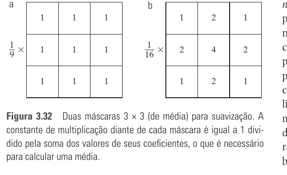
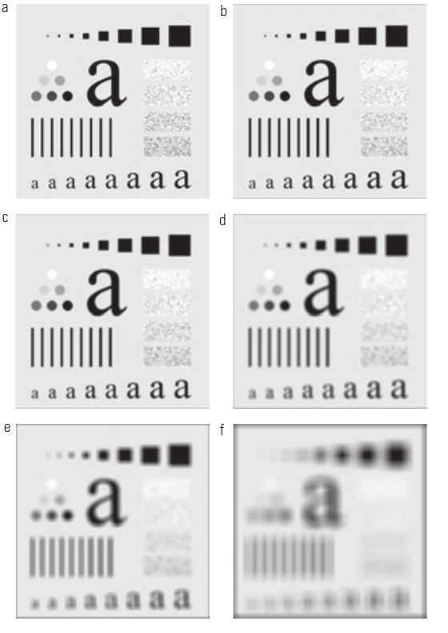
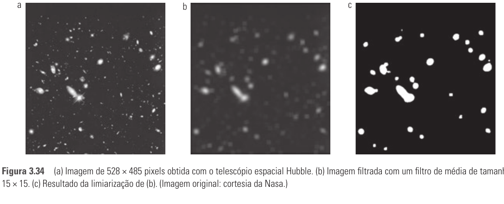
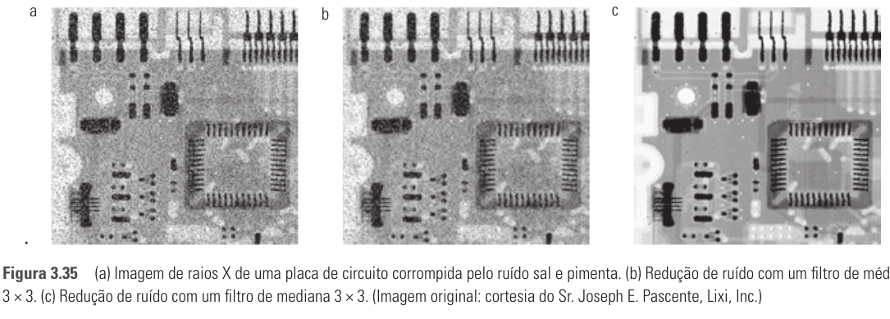

# Seção 3.5 - Filtros Espaciais De Suavização

Páginas usadas: PDF 118-121.

## Ideia Central

- Filtros de suavização reduzem transições bruscas de intensidade.
- O efeito visual principal é borramento, útil para reduzir ruído e detalhes pequenos.
- A suavização também pode preparar a imagem para extração de objetos maiores.

## Fórmulas / Relações Importantes

```text
Média simples 3x3:
R = (1/9) sum_{i=1}^{9} z_i
```

```text
Média ponderada:
g(x,y) =
[sum_{s=-a}^{a} sum_{t=-b}^{b} w(s,t) f(x+s,y+t)]
/
[sum_{s=-a}^{a} sum_{t=-b}^{b} w(s,t)]
```

```text
Filtro máximo 3x3:
R = max{z_k | k = 1, 2, ..., 9}
```

## Conceitos Principais

- Filtros lineares de suavização calculam médias na vizinhança.
- Filtros de média também são chamados de filtros passa-baixa.
- A média reduz ruído aleatório, mas também borra bordas.
- Quanto maior a máscara, maior o borramento e maior a chance de objetos pequenos se misturarem ao fundo.
- A média ponderada dá mais importância a alguns pixels, geralmente ao centro da máscara.
- Filtros de estatística de ordem são não lineares e ordenam os valores da vizinhança.
- O filtro de mediana substitui o pixel central pela mediana dos valores da vizinhança.
- A mediana é especialmente eficaz contra ruído sal e pimenta, com menos borramento que a média.
- Filtro máximo seleciona o maior valor da vizinhança; filtro mínimo seleciona o menor.

## Exemplos E Interpretações

- Uma máscara 3x3 simples com todos os pesos iguais calcula a média aritmética local.
- Uma máscara ponderada como `1 2 1 / 2 4 2 / 1 2 1` preserva um pouco mais a influência do pixel central.
- Aumentar a máscara de 3x3 para 35x35 torna o borramento muito mais agressivo.
- Suavizar e depois aplicar limiarização pode destacar objetos maiores e mais brilhantes.
- Na mediana 3x3, o valor escolhido é o quinto elemento depois da ordenação.
- Pequenos agrupamentos claros ou escuros podem ser eliminados por mediana se forem menores que metade da área da máscara.

## Imagens Da Seção









## Pontos De Prova

- Para que servem filtros espaciais de suavização?
- Por que filtros de média reduzem ruído, mas borram bordas?
- Qual o efeito de aumentar o tamanho da máscara?
- Qual a diferença entre média simples e média ponderada?
- Por que a soma dos pesos aparece no denominador da média ponderada?
- O que caracteriza um filtro de estatística de ordem?
- Por que o filtro de mediana é bom para ruído sal e pimenta?
- Qual a diferença entre filtro de mediana, filtro máximo e filtro mínimo?
