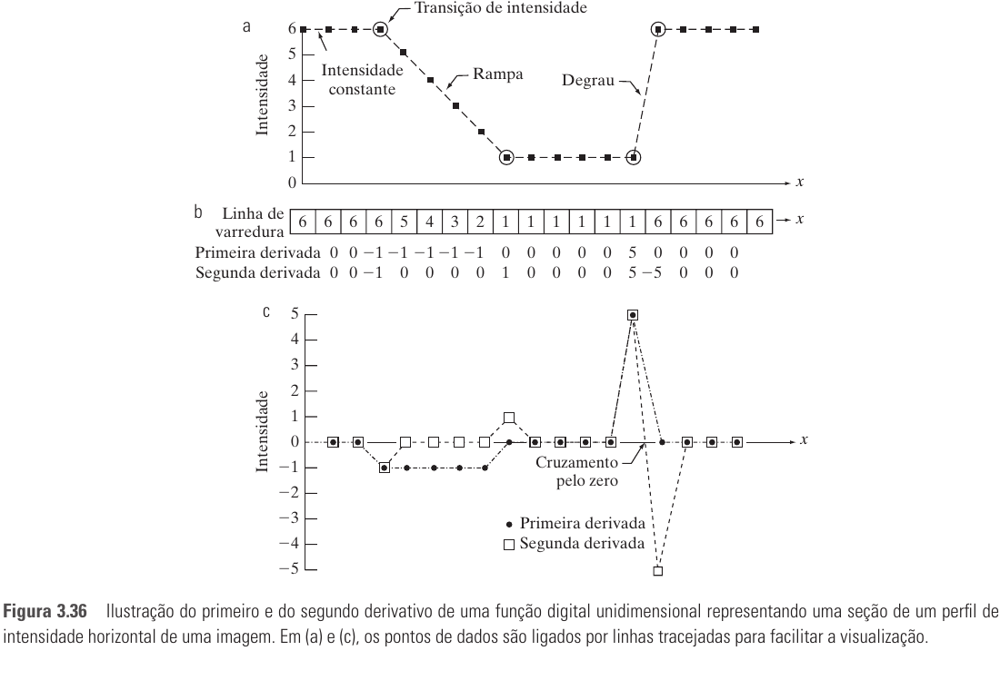
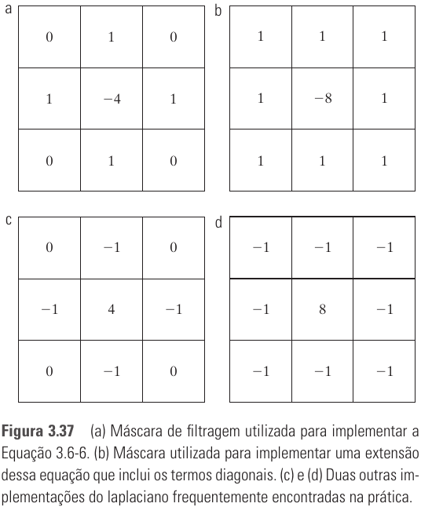
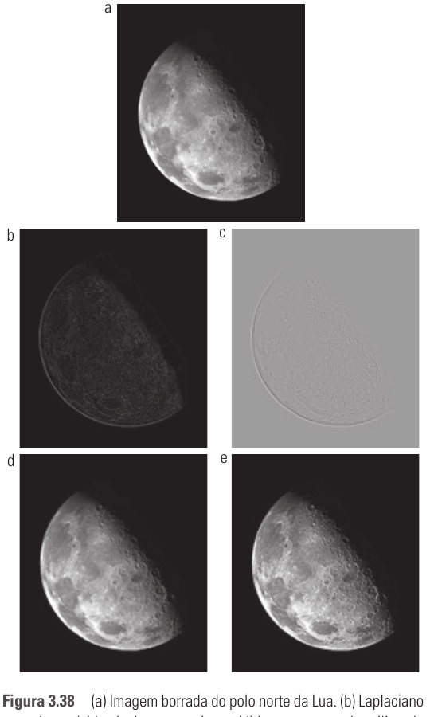
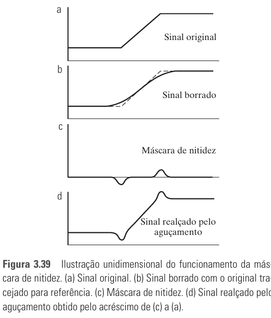
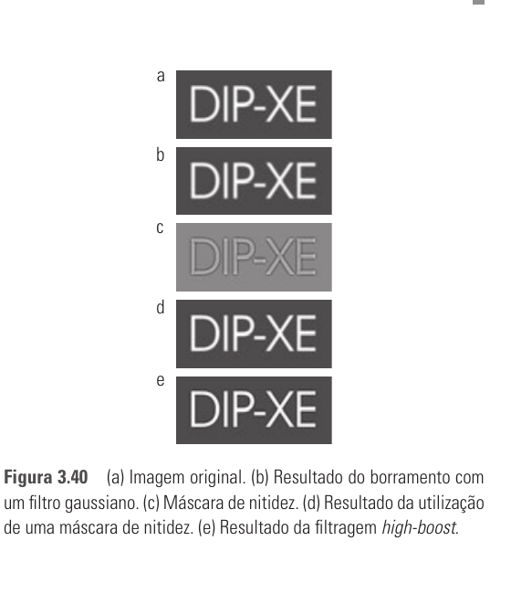
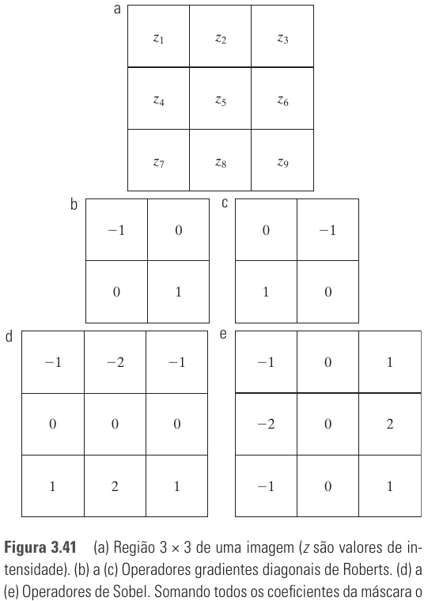
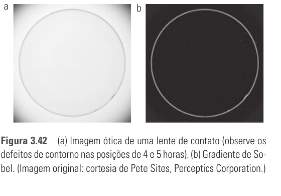

# Seção 3.6 - Filtros Espaciais De Aguçamento

Páginas usadas: PDF 120-128.

## Ideia Central

- Aguçamento realça transições de intensidade para aumentar a nitidez.
- A base do aguçamento espacial é a diferenciação: derivadas respondem forte em bordas, linhas, ruído e descontinuidades.
- O capítulo usa segunda derivada com laplaciano e primeira derivada com gradiente.

## Fórmulas / Relações Importantes

```text
Primeira derivada 1D:
df/dx = f(x + 1) - f(x)
```

```text
Segunda derivada 1D:
d2f/dx2 = f(x + 1) + f(x - 1) - 2f(x)
```

```text
Laplaciano:
nabla2 f = d2f/dx2 + d2f/dy2
```

```text
Laplaciano discreto:
nabla2 f =
f(x+1,y) + f(x-1,y) + f(x,y+1) + f(x,y-1) - 4f(x,y)
```

```text
Aguçamento com laplaciano:
g(x,y) = f(x,y) + c[nabla2 f(x,y)]
```

```text
Máscara de nitidez:
g_mascara(x,y) = f(x,y) - f_borrada(x,y)
g(x,y) = f(x,y) + k * g_mascara(x,y)
```

```text
Magnitude do gradiente:
M(x,y) = sqrt(gx^2 + gy^2)

Aproximação:
M(x,y) ~= |gx| + |gy|
```

## Conceitos Principais

- A primeira derivada é diferente de zero em rampas e degraus.
- A segunda derivada é zero em rampas de inclinação constante e responde no início e no fim das transições.
- A segunda derivada tende a realçar detalhes finos mais fortemente que a primeira.
- O laplaciano é um operador linear, isotrópico e baseado em derivadas de segunda ordem.
- Máscaras laplacianas podem ter centro negativo ou positivo; o sinal define se a imagem laplaciana será somada ou subtraída.
- Máscara de nitidez subtrai uma versão borrada da imagem original para recuperar detalhes.
- High-boost é máscara de nitidez com peso `k > 1`.
- O gradiente aponta para a direção de maior variação de intensidade.
- A magnitude do gradiente é não linear, mesmo que `gx` e `gy` sejam obtidos por filtros lineares.
- Operadores de Roberts usam diferenças diagonais; operadores de Sobel usam máscaras 3x3 com algum efeito de suavização.

## Exemplos E Interpretações

- O laplaciano destaca bordas e detalhes, mas também pode amplificar ruído.
- A imagem laplaciana isolada costuma parecer cinza quando ajustada para visualização.
- Adicionar a imagem original ao laplaciano preserva variações globais e aumenta a nitidez.
- Na máscara de nitidez, valores negativos podem criar halos escuros se o peso for alto demais.
- Sobel é útil para realçar bordas e remover regiões de intensidade constante ou suavemente variável.

## Imagens Da Seção















## Pontos De Prova

- Qual é a relação entre aguçamento e derivadas?
- Como a primeira e a segunda derivada se comportam em áreas constantes, rampas e degraus?
- Por que a segunda derivada é boa para realçar detalhes finos?
- O que é o laplaciano e por que ele é isotrópico?
- Como escolher o sinal na soma/subtração do laplaciano?
- Qual a diferença entre máscara de nitidez e high-boost?
- Por que o gradiente é considerado não linear no cálculo da magnitude?
- Qual a diferença entre operadores de Roberts e Sobel?
