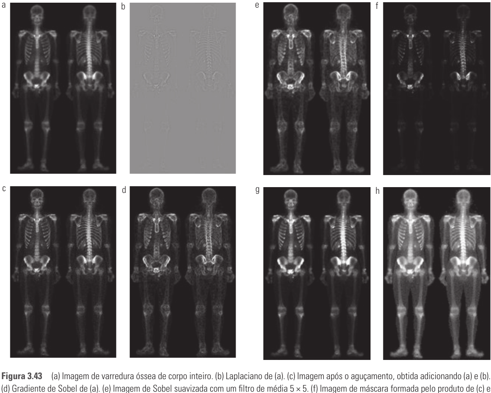

# Seção 3.7 - Combinando Métodos De Realce Espacial

Páginas usadas: PDF 128-130.

## Ideia Central

- Um único método de realce nem sempre resolve o problema.
- Técnicas complementares podem ser combinadas para melhorar nitidez, reduzir ruído e ampliar contraste.
- O exemplo combina laplaciano, gradiente de Sobel, suavização e transformação de potência.

## Fórmulas / Relações Importantes

- Usa fórmulas já vistas: aguçamento com laplaciano, gradiente de Sobel, suavização por média e transformação de potência.

## Conceitos Principais

- O laplaciano realça detalhes finos, mas tende a amplificar ruído.
- O gradiente realça bordas fortes e é menos sensível a ruído fino que o laplaciano.
- Suavizar o gradiente ajuda a formar uma máscara menos ruidosa.
- Multiplicar a imagem laplaciana pelo gradiente suavizado preserva detalhes em regiões de transição forte e reduz ruído em áreas uniformes.
- Depois do aguçamento, pode ser necessário expandir a faixa dinâmica com transformação de intensidade.
- Em imagens médicas, o resultado realçado pode servir como apoio visual, não necessariamente como substituto da imagem original.

## Exemplos E Interpretações

- No exemplo da varredura óssea, a imagem original tem faixa dinâmica estreita e muito ruído.
- O laplaciano sozinho melhora detalhes, mas introduz ruído.
- O gradiente de Sobel destaca bordas proeminentes.
- O gradiente suavizado funciona como máscara para controlar onde o laplaciano deve atuar.
- A transformação de potência com `gamma < 1` clareia detalhes em regiões escuras.

## Imagens Da Seção

## Pontos De Prova

- Por que combinar métodos de realce em vez de usar apenas um?
- Qual é o papel do laplaciano na combinação?
- Qual é o papel do gradiente de Sobel?
- Por que suavizar o gradiente antes de usá-lo como máscara?
- Como a transformação de potência melhora o resultado final?
- Por que imagens médicas realçadas exigem cuidado na interpretação?
