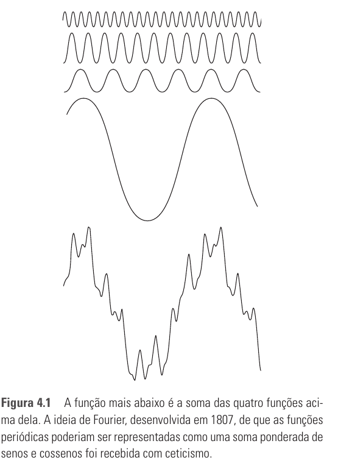

# Seção 4.1 - Fundamentos

Páginas usadas: PDF 149-151.

## Ideia Central

- Fourier mostrou que funções periódicas podem ser representadas como somas ponderadas de senos e cossenos.
- A transformada de Fourier estende essa ideia para funções não periódicas com área finita.
- Essa representação permite trabalhar no domínio de Fourier e retornar ao domínio original sem perda de informação.

## Fórmulas / Relações Importantes

```text
Função periódica complexa = soma ponderada de senos e/ou cossenos
```

```text
Função no domínio original <-> representação no domínio de Fourier
```

## Conceitos Principais

- Série de Fourier: representação de funções periódicas por soma de senos e cossenos com diferentes frequências e coeficientes.
- Transformada de Fourier: representação útil para funções não periódicas de área finita.
- A representação de Fourier é reversível por um processo inverso.
- A utilidade prática da transformada de Fourier fez dela uma ferramenta central em matemática, ciência, engenharia e processamento de sinais.
- A FFT tornou viável o processamento prático de muitos sinais digitais.
- No capítulo, o foco será em funções e imagens de duração finita.
- Os exemplos do capítulo usam principalmente realce de imagens porque suavização, aguçamento e contraste são aplicações intuitivas.
- Outras aplicações de processamento no domínio da frequência aparecem depois nos capítulos 5, 8, 10 e 11.

## Exemplos E Interpretações

- A Figura 4.1 ilustra a ideia de que uma função pode ser construída pela soma de funções senoidais mais simples.
- Fourier aplicou inicialmente suas ideias ao problema de difusão de calor.
- Em imagens, a transformada de Fourier permite estudar e implementar métodos parecidos com os do domínio espacial.

## Imagens Da Seção



## Pontos De Prova

- O que é a série de Fourier?
- Qual a diferença entre série de Fourier e transformada de Fourier?
- Por que a representação de Fourier é útil para processamento de imagens?
- O que significa dizer que a representação pode ser invertida sem perda de informação?
- Qual foi o impacto da FFT no processamento de sinais?
- Por que exemplos de realce são usados para introduzir filtragem no domínio da frequência?
- Em quais capítulos o livro retoma aplicações de processamento no domínio da frequência?
