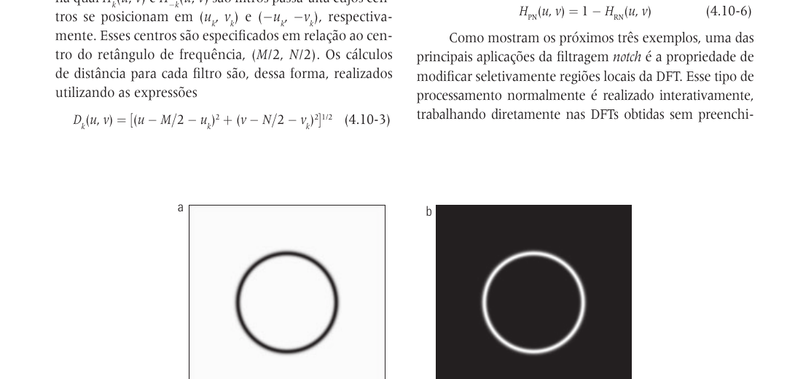
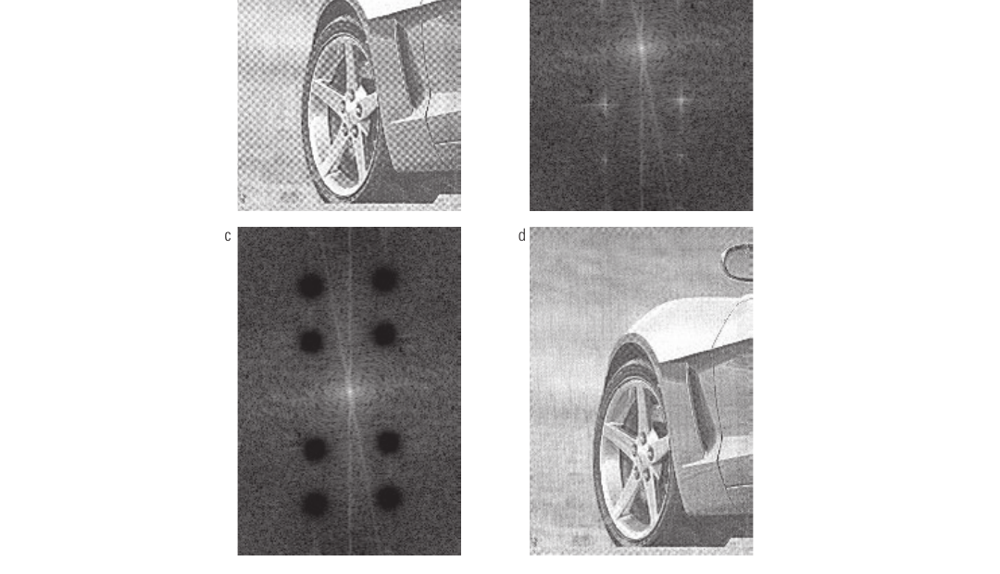
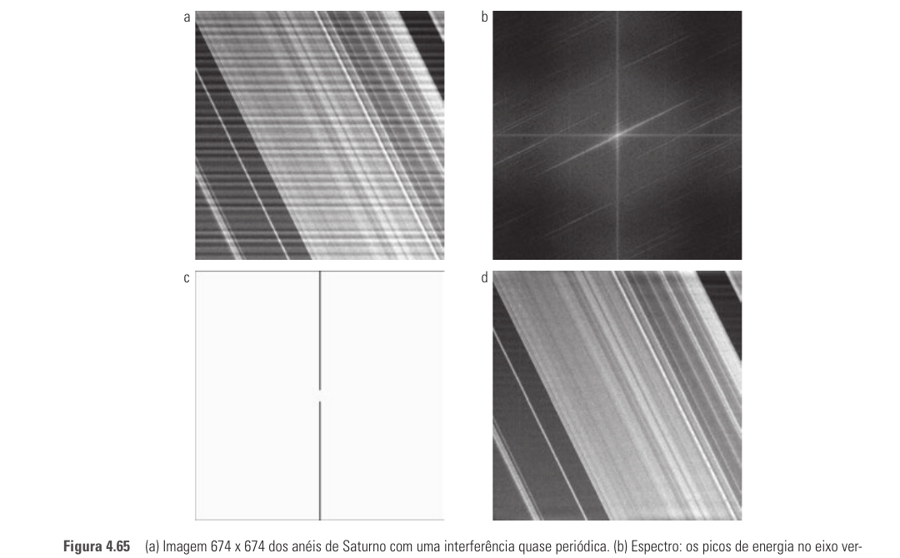
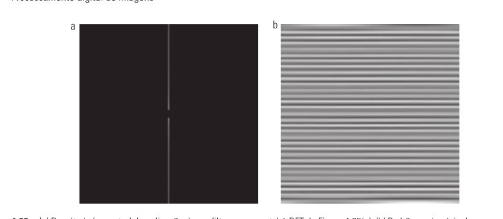

# Seção 4.10 - Filtragem Seletiva

Páginas usadas: PDF 210-214.

## Ideia Central

- Filtragem seletiva remove ou preserva regiões específicas do domínio da frequência.
- É usada quando o problema aparece em uma faixa ou em pontos bem localizados do espectro.
- Os principais casos da seção são filtros rejeita-banda, passa-banda e notch.

## Fórmulas / Relações Importantes

- Relação entre passa-banda e rejeita-banda:

```text
H_BP(u,v) = 1 - H_BR(u,v)
```

- Filtro rejeita-notch com pares simétricos:

```text
H_RN(u,v) = prod_{k=1}^{Q} H_k(u,v) H_-k(u,v)
```

- Distâncias para os centros dos notches:

```text
D_k(u,v) = [(u - M/2 - u_k)^2 + (v - N/2 - v_k)^2]^(1/2)
D_-k(u,v) = [(u - M/2 + u_k)^2 + (v - N/2 + v_k)^2]^(1/2)
```

- Filtro passa-notch:

```text
H_PN(u,v) = 1 - H_RN(u,v)
```

## Conceitos Principais

- Filtro rejeita-banda remove uma faixa circular de frequências.
- Filtro passa-banda preserva uma faixa circular e rejeita o restante.
- Filtros notch atuam em regiões pequenas e localizadas do espectro.
- Notch é útil para ruído periódico, pois esse tipo de degradação aparece como picos brilhantes no espectro.
- Para filtros de fase zero, cada notch em `(u0, v0)` precisa ter um par simétrico em `(-u0, -v0)`.
- O rejeita-notch remove componentes específicas; o passa-notch isola essas componentes.
- Na prática, filtros notch podem ser definidos interativamente olhando o espectro da imagem.

## Exemplos E Interpretações

- Padrão moiré em imagem de jornal: os picos periódicos no espectro são removidos com filtros rejeita-notch.
- Imagem de Saturno: interferência senoidal vertical aparece como componentes concentradas no espectro e pode ser rejeitada por notches estreitos.
- O passa-notch permite visualizar no domínio espacial qual padrão foi removido da imagem.

## Imagens Da Seção









## Pontos De Prova

- Quando usar rejeita-banda em vez de notch?
- Qual é a relação entre filtros rejeita-banda e passa-banda?
- Por que filtros notch precisam de pares simétricos?
- Como ruído periódico aparece no espectro de Fourier?
- Qual a diferença entre rejeita-notch e passa-notch?
- Como um filtro notch remove padrões moiré ou interferência senoidal?
