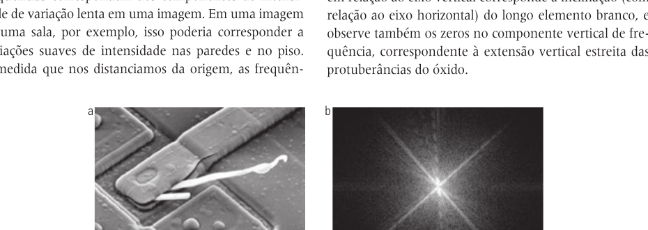
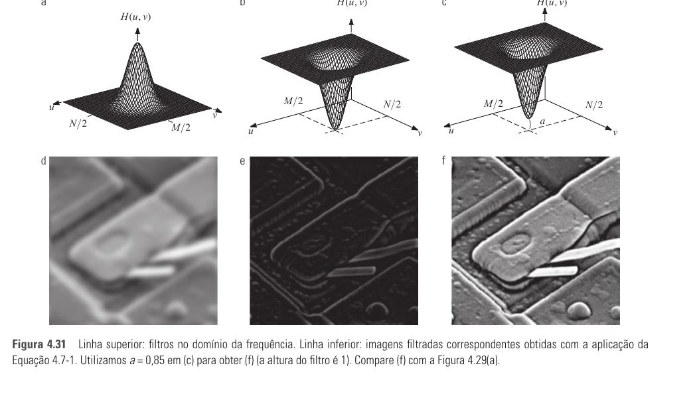
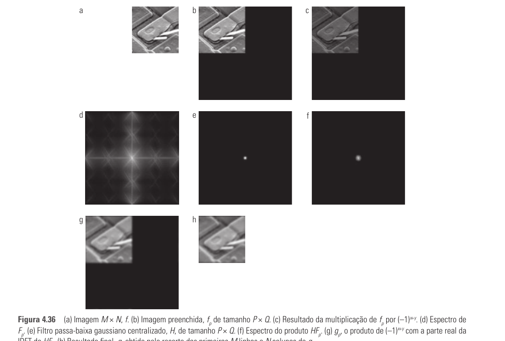
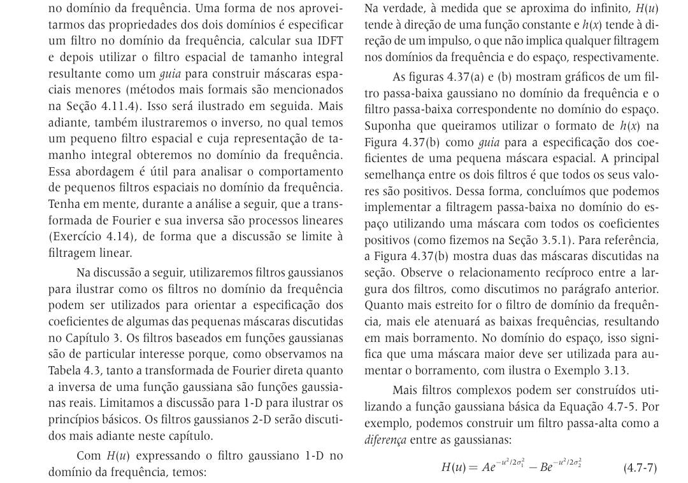
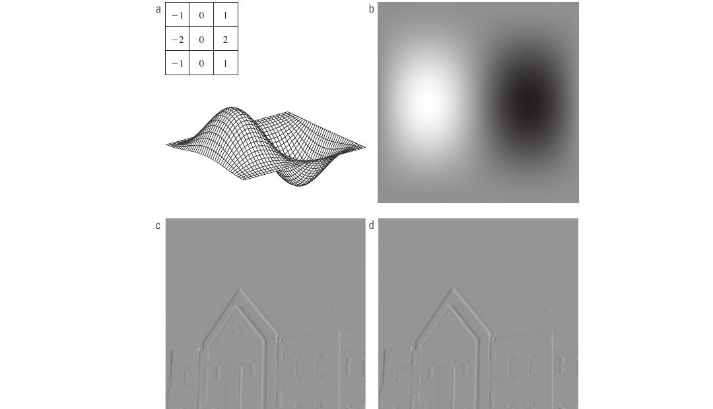

# Seção 4.7 - Fundamentos Da Filtragem No Domínio Da Frequência

Páginas usadas: PDF 184-193.

## Ideia Central

- Filtrar no domínio da frequência significa modificar a transformada de Fourier da imagem e voltar ao domínio espacial pela transformada inversa.
- Baixas frequências representam variações suaves de intensidade.
- Altas frequências representam mudanças rápidas, como bordas, ruído e detalhes finos.

## Fórmulas / Relações Importantes

```text
g(x,y) = IDFT[H(u,v)F(u,v)]
```

```text
F(u,v) = R(u,v) + jI(u,v)
g(x,y) = IDFT[H(u,v)R(u,v) + jH(u,v)I(u,v)]
```

```text
h(x,y) <-> H(u,v)
```

```text
Passa-alta a partir de passa-baixa:
H_HP(u,v) = 1 - H_LP(u,v)
```

## Conceitos Principais

- `F(u,v)` é a DFT da imagem de entrada.
- `H(u,v)` é a função filtro ou função de transferência.
- `g(x,y)` é a imagem filtrada.
- Filtros passa-baixa preservam baixas frequências e borram a imagem.
- Filtros passa-alta preservam altas frequências e realçam detalhes, mas podem reduzir contraste.
- O termo dc representa a intensidade média da imagem.
- Zerar o termo dc deixa a imagem muito escura.
- A DFT assume periodicidade; sem preenchimento, pode ocorrer erro de wraparound.
- Preencher a imagem com zeros reduz efeitos incorretos de convolução circular.
- A fase é essencial para preservar a estrutura espacial da imagem.
- Filtros espaciais e filtros no domínio da frequência são relacionados pelo teorema da convolução.

## Exemplos E Interpretações

- O espectro de uma imagem de circuito mostra componentes alinhados com bordas fortes da imagem.
- Um filtro que zera apenas o centro da transformada remove a média da imagem.
- Um filtro passa-baixa borra bordas e ruído.
- Um filtro passa-alta destaca bordas, mas pode alterar a tonalidade se remover o termo dc.
- A máscara de Sobel também pode ser interpretada por sua resposta no domínio da frequência.

## Imagens Da Seção











## Pontos De Prova

- Qual é a equação básica da filtragem no domínio da frequência?
- O que representam baixas e altas frequências em uma imagem?
- Qual é o papel de `H(u,v)`?
- O que acontece ao remover o termo dc?
- Por que é necessário preencher a imagem antes da filtragem?
- Qual é a relação entre multiplicação no domínio da frequência e convolução no espaço?
- Por que a fase não deve ser ignorada?
