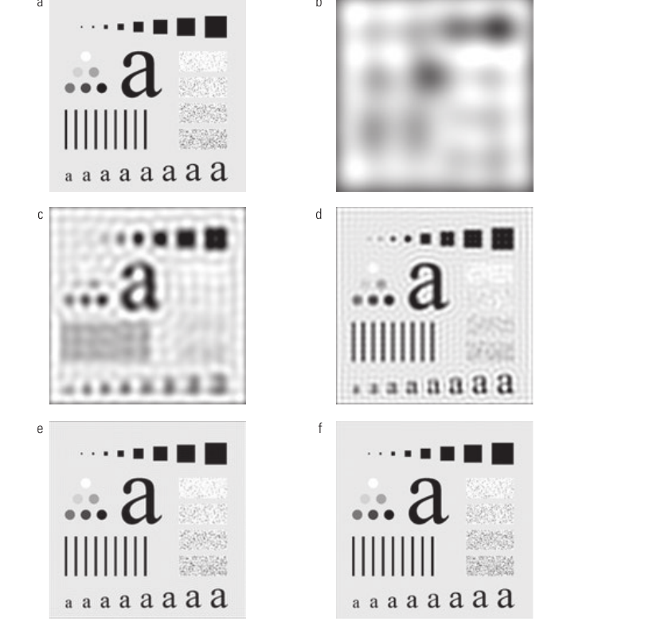
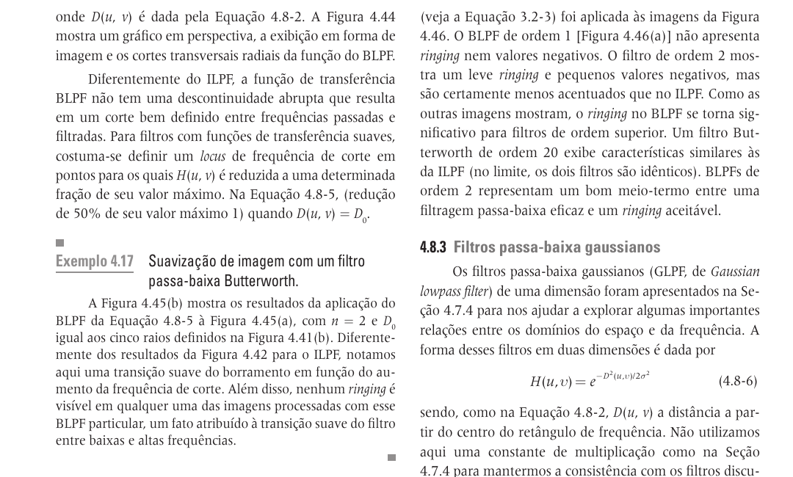
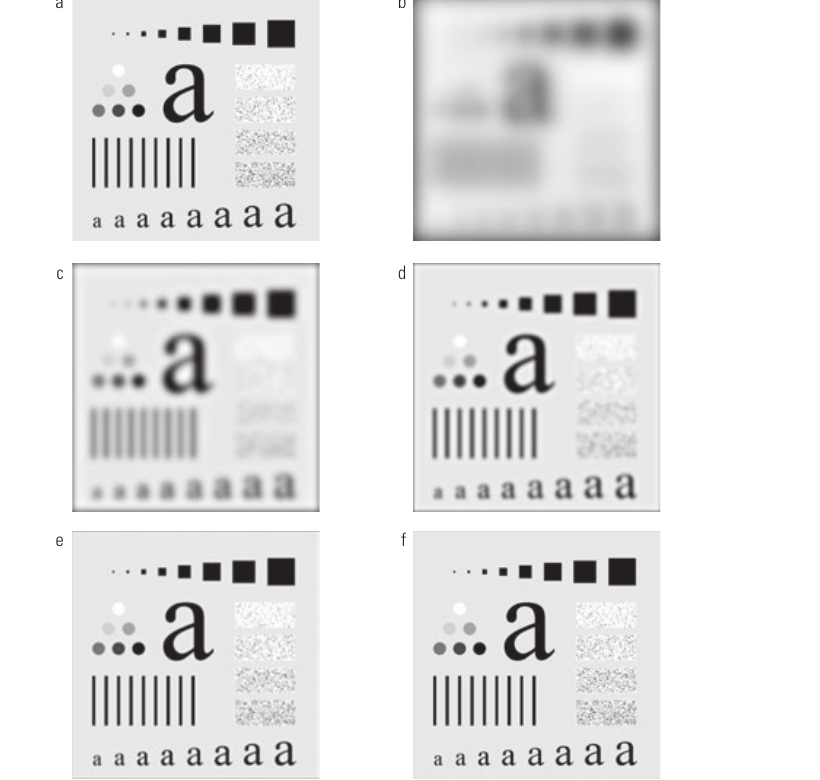
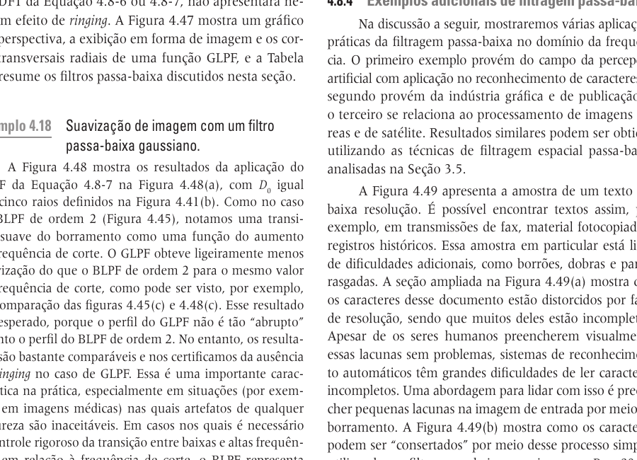
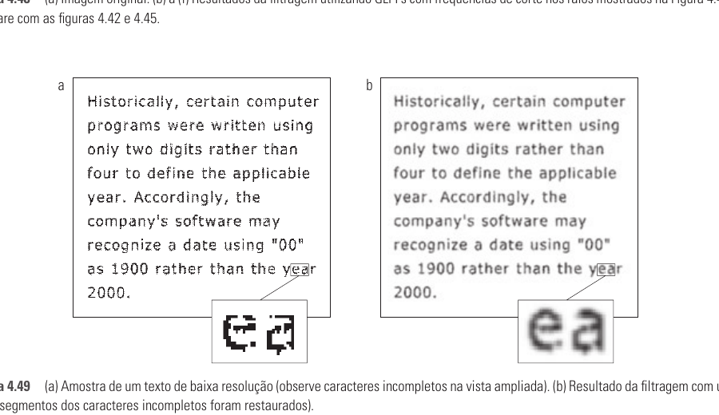

# Seção 4.8 - Suavização De Imagens Utilizando Filtros No Domínio Da Frequência

Páginas usadas: PDF 193-201.

## Ideia Central

- Suavização no domínio da frequência é feita atenuando altas frequências.
- A seção compara filtros passa-baixa ideal, Butterworth e Gaussiano.
- O efeito desejado é borramento e redução de detalhes finos, mas cada filtro produz artefatos diferentes.

## Fórmulas / Relações Importantes

```text
Filtro passa-baixa ideal:
H(u,v) = 1, se D(u,v) <= D0
H(u,v) = 0, se D(u,v) > D0
```

```text
D(u,v) = [(u - P/2)^2 + (v - Q/2)^2]^(1/2)
```

```text
Filtro passa-baixa Butterworth:
H(u,v) = 1 / [1 + (D(u,v)/D0)^(2n)]
```

```text
Filtro passa-baixa Gaussiano:
H(u,v) = e^[-D^2(u,v)/(2D0^2)]
```

## Conceitos Principais

- `D0` é a frequência de corte.
- Quanto menor `D0`, maior o borramento.
- ILPF tem corte abrupto entre frequências passadas e bloqueadas.
- O corte abrupto do ILPF causa ringing no domínio espacial.
- BLPF tem transição mais suave; a ordem `n` controla a inclinação do filtro.
- BLPF de ordem baixa reduz ringing; ordens altas se aproximam do filtro ideal.
- GLPF tem transição suave e não apresenta ringing.
- O preço do GLPF é menor controle rígido sobre a transição entre baixas e altas frequências.
- Filtros passa-baixa podem ser usados para reduzir ruído, restaurar caracteres incompletos e simplificar imagens.

## Exemplos E Interpretações

- No ILPF, aumentar `D0` remove menos potência e reduz o borramento.
- Mesmo removendo pouca potência, o ILPF ainda pode gerar ringing.
- O BLPF de ordem 2 é um meio-termo entre suavização eficaz e ringing aceitável.
- O GLPF produz resultados comparáveis ao BLPF, mas com menos artefatos.
- Em texto de baixa resolução, o GLPF pode preencher pequenas falhas nos caracteres.
- Em rostos, a filtragem passa-baixa suaviza linhas finas e manchas.
- Em imagens de satélite, a suavização pode reduzir linhas de varredura e detalhes menores que o objeto de interesse.

## Imagens Da Seção











## Pontos De Prova

- Como a suavização é feita no domínio da frequência?
- O que é frequência de corte `D0`?
- Por que o ILPF causa ringing?
- Como a ordem `n` afeta o filtro Butterworth?
- Qual a principal vantagem do filtro Gaussiano?
- Em que situações o ringing é inaceitável?
- Como filtros passa-baixa podem ajudar em OCR ou pré-processamento?
