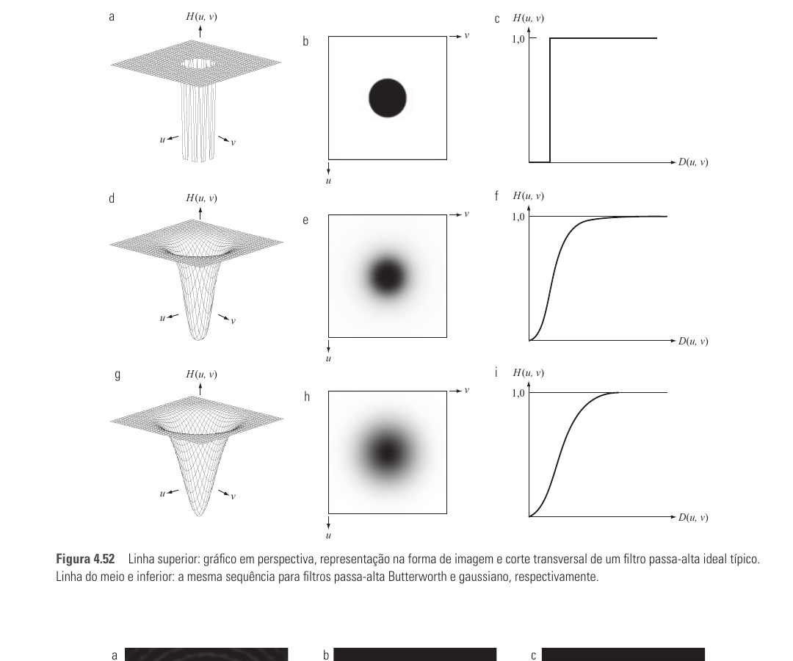
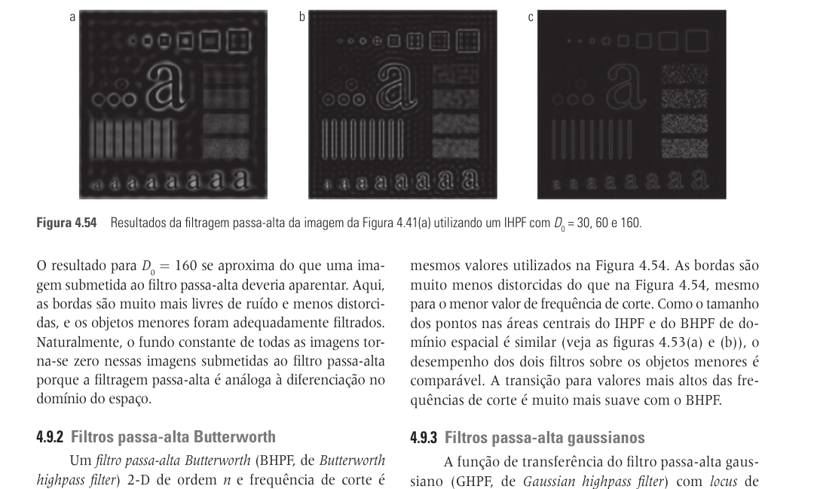
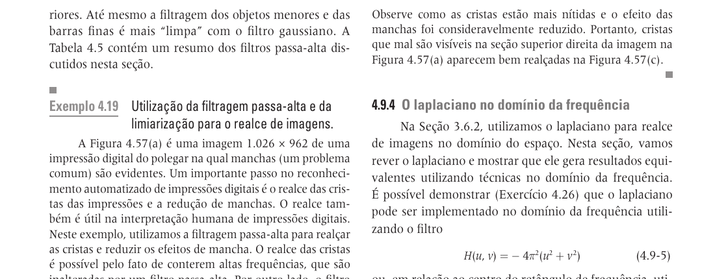
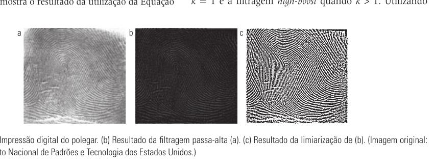
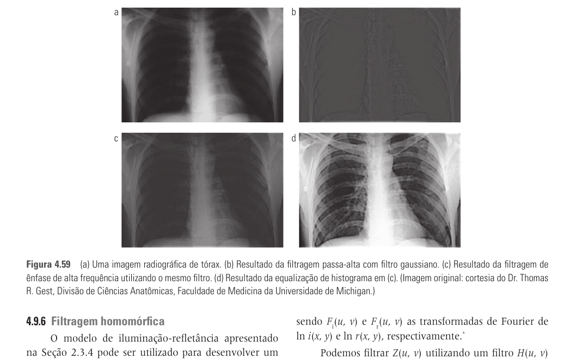
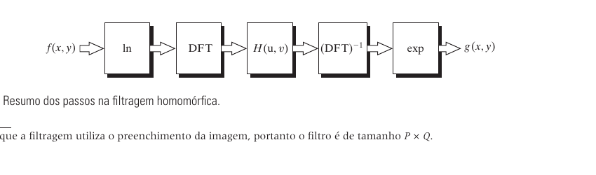
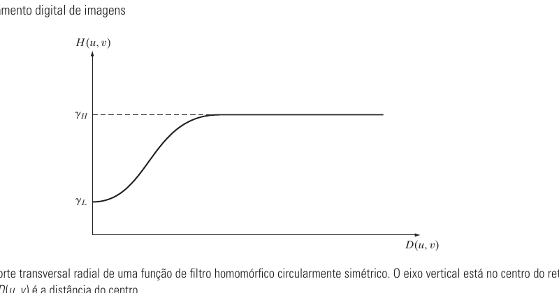
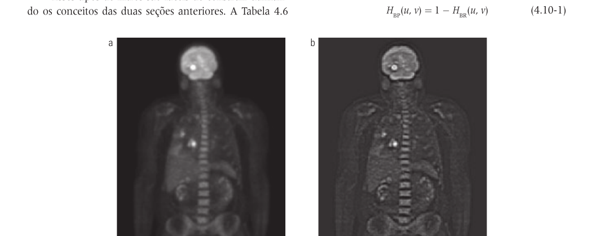

# Seção 4.9 - Aguçamento De Imagens Utilizando Filtros No Domínio Da Frequência

Páginas usadas: PDF 201-210.

## Ideia Central

- Aguçamento no domínio da frequência usa filtros passa-alta.
- A lógica é reduzir baixas frequências e preservar ou ampliar altas frequências.
- Bordas, detalhes finos e transições abruptas aparecem nas altas frequências.
- A filtragem passa-alta é o complemento direto da filtragem passa-baixa.

## Fórmulas / Relações Importantes

- Relação entre filtro passa-alta e passa-baixa:

```text
H_HP(u,v) = 1 - H_LP(u,v)
```

- Filtro passa-alta ideal:

```text
H(u,v) = 0, se D(u,v) <= D0
H(u,v) = 1, se D(u,v) > D0
```

- Filtro passa-alta Butterworth:

```text
H(u,v) = 1 / [1 + (D0 / D(u,v))^(2n)]
```

- Filtro passa-alta gaussiano:

```text
H(u,v) = 1 - e^[-D^2(u,v)/(2D0^2)]
```

- Laplaciano no domínio da frequência:

```text
H(u,v) = -4*pi^2*(u^2 + v^2)
H(u,v) = -4*pi^2*D^2(u,v)
nabla^2 f(x,y) = IDFT[H(u,v)F(u,v)]
g(x,y) = f(x,y) + c*nabla^2 f(x,y)
```

- Máscara de nitidez e high-boost:

```text
g_mascara(x,y) = f(x,y) - f_LP(x,y)
g(x,y) = f(x,y) + k*g_mascara(x,y)
```

- Ênfase de alta frequência:

```text
g(x,y) = IDFT{[1 + k*H_HP(u,v)]F(u,v)}
g(x,y) = IDFT{[k1 + k2*H_HP(u,v)]F(u,v)}
```

- Modelo de filtragem homomórfica:

```text
f(x,y) = i(x,y)r(x,y)
z(x,y) = ln f(x,y) = ln i(x,y) + ln r(x,y)
```

```text
H(u,v) = (gamma_H - gamma_L)[1 - e^(-c[D^2(u,v)/D0^2])] + gamma_L
```

## Conceitos Principais

- O filtro passa-alta ideal remove bruscamente frequências abaixo de `D0`.
- O passa-alta ideal tende a produzir ringing, pois sua transição no espectro é abrupta.
- O Butterworth permite controlar a suavidade da transição pela ordem `n`.
- O gaussiano produz transição mais suave e, em geral, menos artefatos visuais.
- Imagens filtradas apenas por passa-alta podem perder tons de cinza, pois o componente DC e baixas frequências são removidos.
- O laplaciano no domínio da frequência é equivalente ao laplaciano no domínio espacial.
- Na fórmula do laplaciano, o filtro é negativo; por isso, no aguçamento costuma-se usar `c = -1`.
- Máscara de nitidez soma à imagem original uma versão dos detalhes obtidos pela subtração da imagem suavizada.
- `k = 1` corresponde à máscara de nitidez; `k > 1` corresponde à filtragem high-boost.
- Ênfase de alta frequência preserva parte das baixas frequências enquanto reforça as altas.
- Na filtragem homomórfica, iluminação tende a ocupar baixas frequências e refletância tende a ocupar altas frequências.
- O filtro homomórfico reduz variações de iluminação e aumenta contraste de detalhes.

## Exemplos E Interpretações

- Impressão digital: o passa-alta realça cristas e detalhes; depois pode ser aplicada limiarização para obter imagem binária.
- Raio X: a ênfase de alta frequência melhora detalhes finos sem eliminar totalmente a aparência global da imagem.
- PET: a filtragem homomórfica melhora contraste quando a iluminação ou ganho varia lentamente pela imagem.

## Imagens Da Seção

















## Pontos De Prova

- Como obter um filtro passa-alta a partir de um filtro passa-baixa?
- Por que filtros passa-alta realçam bordas?
- Qual é a diferença visual entre passa-alta ideal, Butterworth e gaussiano?
- Por que o passa-alta ideal pode gerar ringing?
- Como o laplaciano é representado no domínio da frequência?
- Qual a diferença entre máscara de nitidez e high-boost?
- Por que a ênfase de alta frequência preserva melhor a aparência global da imagem?
- Qual é a ideia da filtragem homomórfica?
- Como iluminação e refletância são tratadas no modelo homomórfico?
